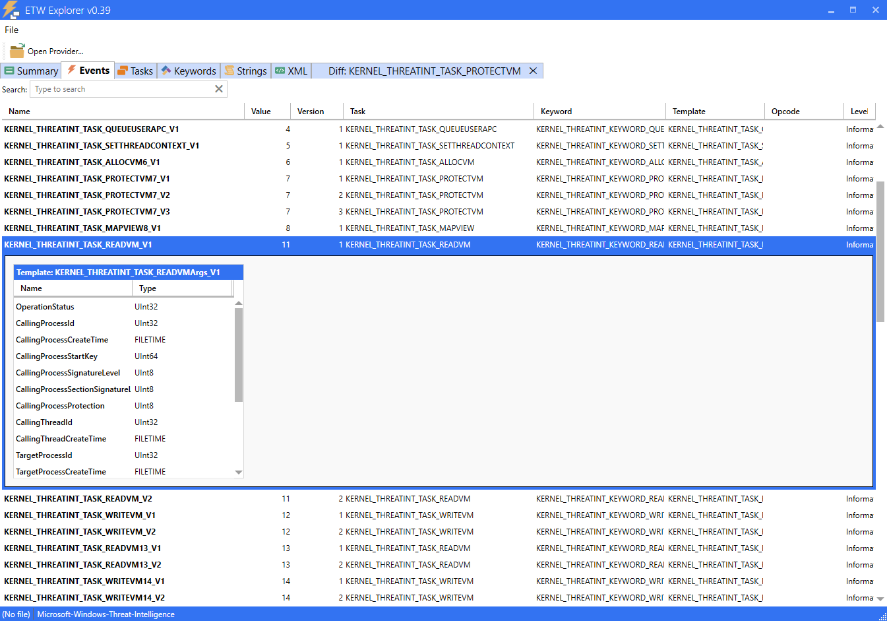
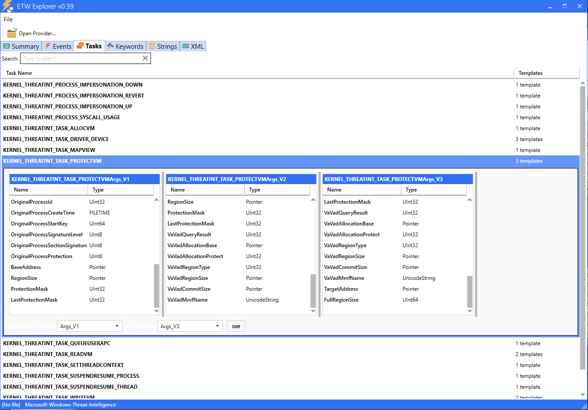
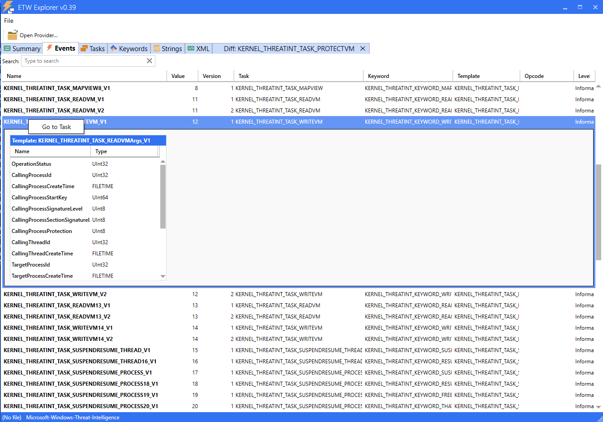

# EtwExplorer
View ETW Provider metadata

Event Tracing for Windows ([ETW](https://docs.microsoft.com/en-us/windows/win32/etw/event-metadata-overview)) is a logging facility built into the Windows OS. Modern providers register a manifest that describes all the events they support, with their properties. Classic providers register a MOF instead.

ETW Explorer attempts to show these events with a simple GUI.

## Added Features

This is a fork of zodiacon's EtwExplorer that adds Task version diffing.

Tasks can be viewed as a list in the Tasks tab with side by side argument comparison:

And tasks with multiple versions can be diff'd to view the raw template XML comparison:

Additionally when browsing events, you can right click the event and select "Go to task" to naviate directly to the task comparison view:

